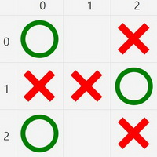
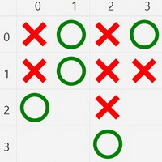
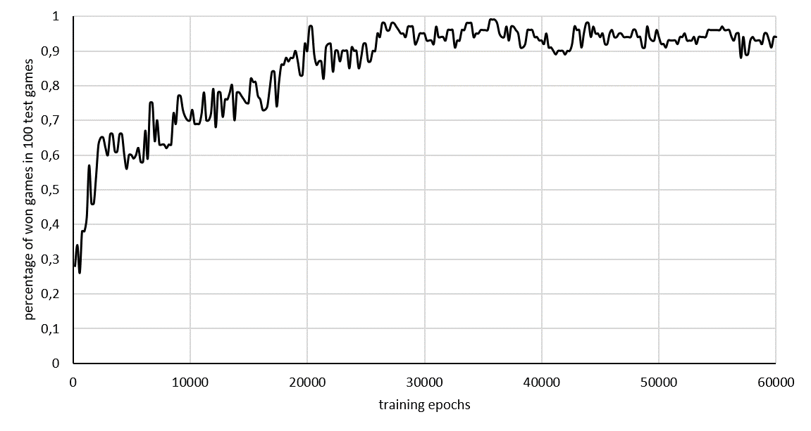

# Tic Tac Toe - AI Training

A project written in scala, which uses reinforcement learning to train an AI player for the mini game tictactoe.

There are two different dimensions: The normal 3x3 tictactoe and the advanced 4x4.

 

## Start a training 

All trainings has as entry point the file 
```administration/src/main/scala/de/ai/htwg/tictactoe/TrainMain.scala```.

Here you can configure the whole training:

```
val properties = LearningProcessorConfiguration(
    strategy.dimensions, // dimension of learned tic tac toe 3x3 or 4x4
    buildEpsGreedyConfiguration(random), // exploration strategy config
    QLearningConfiguration(
      alpha = 0.03, // q learning alpha value
      gamma = 0.3, // q learning gamma value
      batchSize = 1000 // size of training batch
    ),
    NeuralNetConfiguration(
      hiddenLayers = 5,
      hiddenNodes = 64,
      inputNodes = strategy.dimensions * strategy.dimensions * 2,
      activationFunction = Activation.RELU
    ),
    TTTRewardCalculator.RewardConfiguration(
      won = 100, // reward if game is won
      drawDefense = 90, // draw and ai player has begun
      drawOffense = 90, // draw and other player has begun
      lost = -500, // qi player lost the game
      immediateStartingPlayer = 1, // when ai player has begun
      immediate = 1 // when other player has begun
    )
  )
```

Then you can select the training epochs:

```
trainer.startTraining(60000)
```

Now, just run the training! After the training has finished, you can play against your trained AI with the started UI.

For easier debugging, you should know, that the AI Player is always Cross and you are always Circle.

## Display learning charts

Every training has a unique ID and logs every test epoch into a CSV file. You could find all files under: ```/results```.

These files contain the current configuration and the statistic data of every test epoch. You can use this CSV file to display any learning chart.

F.e. the default training run:



## Deterministic training

Every training has a seed. With the same seed, the whole training is deterministic. Every test epoch is also instantiated with a test seed. You could change the seed in the ```TrainMain``` configuration under
```
val seed = -292423813451567322L
val testSeed = 127368234235L
```

## Play against already trained

If you had run a training, your trained network is persisted under ```/nets```. Here you can find multiple instances of your training run after some training epochs.

In the file 
```administration/src/main/scala/de/ai/htwg/tictactoe/PlayAgainstAiMain.scala``` you can configure your trained network file:

```
val network3 = "Vs8Syg.2018-05-19-18-57-44-372.network.zip"
val network4 = "ufML8a.2018-05-21-10-59-08-912.network.zip"
val networkName = network4
```
Choose the dimension you have trained with ```networkName``` and then configure the game dimension in 
```administration/src/main/scala/de/ai/htwg/tictactoe/PlayAgainstAiMain.scala``` under 
```
val strategy3 = TTTWinStrategy3xBuilder
val strategy4 = TTTWinStrategy4xBuilder
val strategy = strategy4
```

Now just run one of these application entry points:

- **PlayAgainstNetMain** - simply play against your trained network
- **PlayAgainstNetMiniMaxDepthMain** - play against a combination of a minimax logic player and your trained network
- **PlayAgainstNetMiniMaxWidthDepthMain** - play against a combination of a minimax logic player and your trained network

another possibility is to play against a minimax logic player without using your trained network:

- **PlayAgainstMiniMax** - play against a logic player (could)
